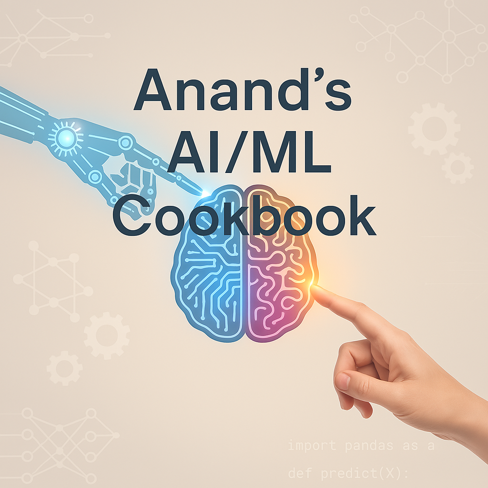

# Anand’s AI/ML Cookbook
_"A real-world framework for building intelligent, ethical, and explainable systems."_


## 🗂️ Table of Contents
1. Project Development Principles  
2. Product Development Mindset  
3. Governance & Non-Functional Requirements (NFRs)  
4. Ethics & Responsibility  
5. The AI/ML Project Blueprint  
6. Vision Space – Innovation Log  
7. Collaboration & Communication Philosophy  
8. Experimentation & Feedback Loops  
9. Security & Abuse Prevention  
10. Knowledge & Learning System  
11. My Personal Laws  
12. Project & Product Development Distinction  
13. Agile, ART & Delivery Mindset

---

## 1. Project Development Principles
> *"Engineer it like it's going to production tomorrow."*

- Build modular pipelines: ingestion → validation → processing → model → deployment  
- CI/CD is a default — automate everything you can from day one  
- Use drift and quality monitoring in all stages of the lifecycle  
- Version all assets: datasets, features, embeddings, models, configs  
- Monitoring and fallback logic should be built into your architecture

---

## 2. Product Development Mindset
> *"Every AI system is a user-facing product, even if there's no UI."*

- Focus on user intent and usability, not just model metrics  
- Build systems that communicate outputs clearly and allow interaction  
- Validate product assumptions early via MVPs and iterate fast  
- Don’t just optimize performance — optimize trust, control, and context

---

## 3. Governance & NFRs
> *"If I can’t trace it, test it, or justify it — I don’t ship it."*

### Governance Rules:
- Maintain audit trails for all decisions, models, and data transformations  
- Use role-based access for data security and compliance  
- Ensure model lifecycle tracking, retraining triggers, and version control  
- Implement observability: alerts, logs, dashboards, metadata

### Non-Functional Requirements (NFRs):
| Category       | Standard                             |
|----------------|--------------------------------------|
| Latency        | < 500ms (inference)                  |
| Scalability    | Horizontal scaling enabled           |
| Resilience     | Failover, retry, and fallback logic  |
| Security       | Tokenized APIs, encrypted data flow  |
| Maintainability| Config-driven and modular structure  |
| Explainability | Transparent model decisions + logs   |

---

## 4. Ethics & Responsibility
> *"Code that isn’t conscious is dangerous."*

- Test for bias across inputs, predictions, and usage feedback  
- Respect privacy with data minimization and secure storage  
- Don’t deploy black-box systems that impact people without auditability  
- Build explainable components and allow user override or feedback

---

## 5. The AI/ML Project Blueprint
> *"A 10-step personal roadmap for building AI systems from scratch."*

1. **Define the Problem**  
   Clarify scope, goal, user, and real-world constraints.

2. **Research & Strategy**  
   Understand existing solutions, techniques, and what has/hasn’t worked before.

3. **Data Collection & Exploration**  
   Ingest data, run EDA, visualize, detect anomalies.

4. **Validation & Preprocessing**  
   Schema validation, missing data handling, normalization, domain logic.

5. **Modeling / Retrieval / Learning**  
   Start with baselines, apply heuristics, test scalable techniques.

6. **Evaluation**  
   Choose correct metrics: accuracy, precision@k, NDCG, BLEU, etc.

7. **Deployment**  
   Containerize, deploy via FastAPI/Flask, automate with CI/CD.

8. **Monitoring**  
   Add WhyLogs, Prometheus, or custom drift + performance checks.

9. **User Interface or API Layer**  
   Build a simple UI or robust API — ensure transparency & usability.

10. **Audit, Governance, and Feedback Loop**  
    Log everything, monitor usage, allow input for improvements.

### 🌐 Example:
- **Use Case**: Predicting customer churn
- **Steps**: 
  - EDA shows 20% churn rate, strong class imbalance  
  - Model: XGBoost baseline + SMOTE sampling  
  - Evaluation: ROC AUC + recall on minority class  
  - Deployment: Dockerized inference API with model monitoring via MLflow

---

## 6. Vision Space – Innovation Log
> *"A notebook for future systems, features, or experiments."*

Use this template:
```
### Idea Title: [Name]
- Problem: [What's broken or missing?]
- Solution: [What could fix it?]
- Tech Needed: [Libraries, frameworks, infra]
- Business Impact: [Why does it matter?]
- Constraints: [Latency, data availability, etc.]
- MVP Plan: [How to test it fast]
```

Example:
**Drift-Aware Smart Ingestion**  
Problem: Data changes silently break pipelines  
Solution: Add WhyLogs + auto-generated summaries + alert triggers  
Tech: WhyLogs, Jenkins, Streamlit  
Impact: Prevent silent failures, increase stakeholder trust  
MVP: Dummy dataset → Drift check → Slack alert + Streamlit dashboard

---

## 7. Collaboration & Communication Philosophy
> *"If others can't extend it or understand it, I haven’t finished building it."*

- Document architecture, pipeline design, and assumptions clearly  
- Use diagrams and README files for onboarding  
- Maintain changelogs and commit messages that explain decisions  
- Communicate across teams with clarity, especially during handoffs  
- Share early, iterate together — avoid “final version” silos

---

## 8. Experimentation & Feedback Loops
> *"Test small. Log everything. Let feedback shape evolution."*

- Use feature flags and config switches for easy A/B testing  
- Track experiments in MLflow, Notion, or markdown logs  
- Define success criteria before launching any experiment  
- Incorporate user, stakeholder, and metric-based feedback  
- Roll back safely. Learn from each iteration.

---

## 9. Security & Abuse Prevention
> *"If it can be exploited or misused, it's my job to defend it."*

- Respect compliance standards (GDPR, internal data policies)  
- Sanitize and validate user input  
- Audit for ranking or recommendation manipulation  
- Encrypt sensitive data at rest and in transit  
- Build abuse detection triggers into your logs and pipelines

---

## 10. Knowledge & Learning System
> *"Every experiment, failure, and insight is an asset."*

- Maintain a personal or team knowledge repo (Markdown, Notion, Obsidian)  
- Store learnings from past deployments and experiments  
- Tag insights with context: project, challenge, outcome  
- Version your knowledge like your code — keep it evolving  
- Revisit and refine principles based on real-world feedback

---

## 11. My Personal Laws
> *"These guide every line I write and every system I build."*

- If it’s not traceable, it’s not trustworthy  
- If it’s not explainable, it’s not deployable  
- If it repeats effort, automate it  
- If it affects people, audit it  
- If it fails silently, it’s failing completely  
- If it’s reusable, make it portable  
- If it’s live, monitor it  
- If it’s personal data, protect it  
- If someone else needs it, document it

---

## 12. Project & Product Development Distinction
> *"Understand the difference — build both right."*

### Project Development:
- Focus: Technical delivery (pipelines, models, deployment)
- Outcome: Scalable, testable, performant systems
- Ends with: Stable working system

### Product Development:
- Focus: User needs, business alignment, experience design
- Outcome: Solves the right problem, not just any problem
- Ends with: Adoption, feedback, trust, and iteration

---

## 13. Agile, ART & Delivery Mindset
> *"Delivering AI value is iterative, collaborative, and always aligned with business rhythm."*

- Use Agile principles (epics, user stories, sprints) to break large goals into deliverable chunks  
- Apply ART (Agile Release Train) when working cross-team with synchronized delivery  
- Always align AI goals with stakeholder OKRs and business priorities  
- Deliver value incrementally — every sprint should ship something that can be validated or learned from  
- Keep AI workflows transparent and demo-ready — let the business see progress, not just metrics

---

> _"This cookbook isn't just about building ML models. It's about building systems that last, learn, and live up to their impact."_

